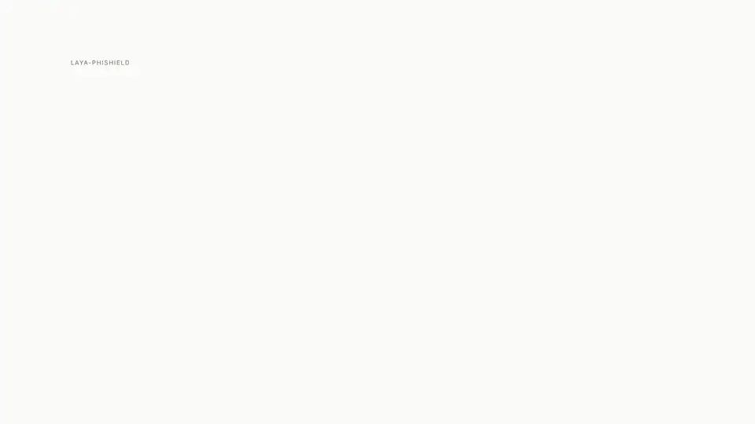
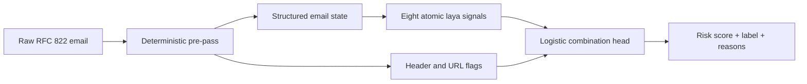
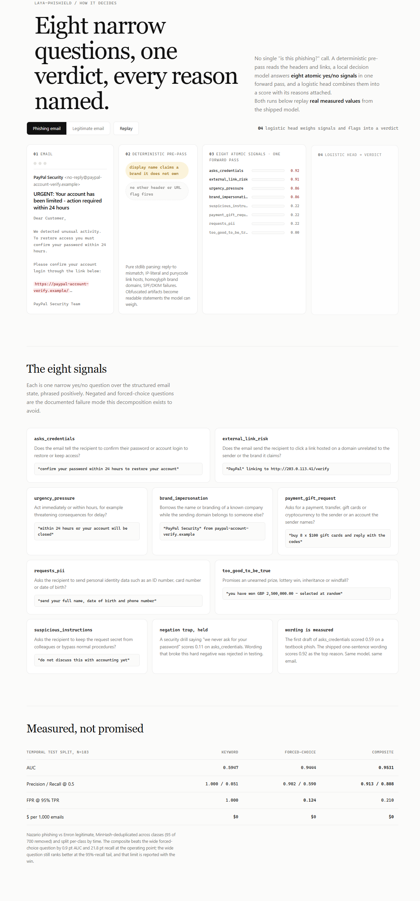
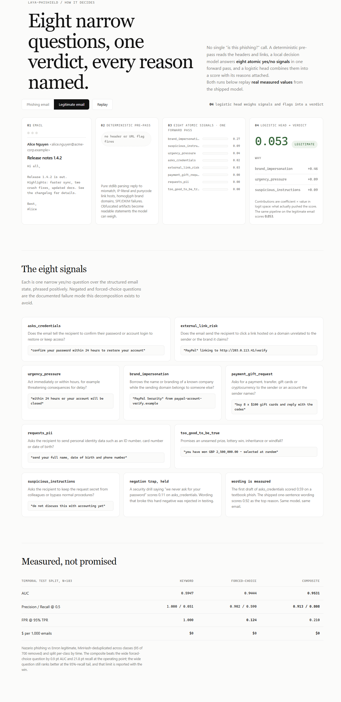

<p align="center">
  
</p>

<h1 align="center">laya-phishield</h1>

<p align="center">
  <strong>Explainable phishing detection that runs locally.</strong><br>
  Eight focused semantic signals and deterministic email checks become one risk score—with every reason attached.
</p>

<p align="center">
  <a href="https://www.python.org/"></a>
  <a href="https://pypi.org/project/laya-phishield/"></a>
  <a href="https://fastapi.tiangolo.com/"></a>
  <a href="LICENSE"></a>
  
  
</p>

<p align="center">
  <a href="#quick-start">Quick start</a> ·
  <a href="#how-it-works">How it works</a> ·
  <a href="#evaluation">Evaluation</a> ·
  <a href="docs/how-it-works.html">Interactive explainer</a>
</p>

---

<p align="center">
  <a href="brag-output/brag.mp4">
    
  </a><br>
  <sub>Autoplays and loops · ▶ <a href="brag-output/brag.mp4">Open the 1080p video</a></sub>
</p>

## The short version

Most phishing classifiers answer one broad question: *“Is this phishing?”* That can produce a useful score, but it gives an analyst little evidence to review.

`laya-phishield` decomposes that decision into eight narrow yes/no signals. A deterministic pre-pass catches header and URL artifacts, [laya](https://github.com/NandhaKishorM/laya) evaluates the semantic signals locally in one forward pass, and a logistic head combines everything into an auditable verdict.

<table>
  <tr>
    <td align="center"><strong>0.9531</strong><br><sub>test AUC</sub></td>
    <td align="center"><strong>0.913</strong><br><sub>precision @ 0.5</sub></td>
    <td align="center"><strong>0.808</strong><br><sub>recall @ 0.5</sub></td>
    <td align="center"><strong>$0</strong><br><sub>API cost / 1,000 emails</sub></td>
  </tr>
</table>

> [!NOTE]
> This is an early-stage research project, not a replacement for a production secure email gateway. Benchmark results come from the shipped temporal test split; see [Evaluation](#evaluation) for the methodology and limits.

## Why this approach

- **Explainable by construction.** Each verdict includes signal probabilities, deterministic flags, and the features that contributed most to the score.
- **Local and inexpensive.** Detection runs on a local laya decision model; email content does not need to be sent to a hosted LLM API.
- **Harder to fool with obfuscation.** Header, domain, punycode, homoglyph, SPF, and DKIM checks complement semantic analysis.
- **Operationally flexible.** Scan `.eml`, `.mbox`, or `.jsonl` files, call the HTTP API, or use the Streamlit demo.
- **Measured honestly.** Near-duplicates are removed before a per-class temporal split, and the documented tail-recall limitation is kept visible.

## How it works



1. **Parse and inspect.** [`extract.py`](src/laya_phishield/extract.py) extracts the subject, sender and reply-to domains, first URL host, and a plain-text body excerpt. It also raises deterministic flags for reply-to mismatch, IP-literal or punycode links, brand homoglyphs, brands hidden in subdomains, display-name mismatch, and SPF/DKIM failures.
2. **Score eight atomic signals.** [`signals.py`](src/laya_phishield/signals.py) asks the local decision model eight positively phrased questions in one forward pass. The full contract and hard negatives live in [`data/signals_schema.md`](data/signals_schema.md).
3. **Combine and explain.** A trained logistic head weighs the eight probabilities and deterministic flags. It returns a score, a label, and the top feature contributions rather than an opaque binary decision.

### The eight signals

| Signal | What it asks |
|---|---|
| `asks_credentials` | Does the email ask the recipient to confirm a password or account login? |
| `urgency_pressure` | Does it demand immediate action or threaten consequences for delay? |
| `payment_gift_request` | Does it request money, gift cards, a transfer, or cryptocurrency? |
| `brand_impersonation` | Does it borrow a known brand while using an unrelated sender domain? |
| `requests_pii` | Does it request identity, card, or other sensitive personal data? |
| `too_good_to_be_true` | Does it promise an unearned prize, inheritance, or windfall? |
| `suspicious_instructions` | Does it ask the recipient to keep secrets or bypass normal procedure? |
| `external_link_risk` | Does it point to a host unrelated to the claimed sender or brand? |

## Quick start

Requires Python 3.10+ and [uv](https://docs.astral.sh/uv/). Released on PyPI,
so either install directly (note: this pulls `laya` and with it
`torch`/`transformers`, roughly a gigabyte of wheels) or clone for the eval
tooling and demo:

```bash
uv tool install laya-phishield        # or: uv pip install laya-phishield
```

```bash
git clone https://github.com/Gjusev/laya-phishield.git
cd laya-phishield
uv venv
uv pip install -e .

# Scan one email, a mailbox, or JSONL records shaped as {"raw": "..."}
uv run laya-phishield scan suspicious.eml
uv run laya-phishield scan inbox.mbox --json
uv run laya-phishield scan mail-1.eml mail-2.eml --limit 100
```

The model checkpoint is downloaded on first use. Human-readable output names the strongest reasons; `--json` emits one complete verdict object per email.

```text
PHISHING 0.990  suspicious.eml#1  [asks_credentials 2.56, urgency_pressure 1.86]
1 email scanned, 1 flagged
```

### HTTP API

Start the app as a Uvicorn factory so the model remains lazy-loaded. The command below adds Uvicorn to the run environment without changing the project dependencies:

```bash
uv run --with uvicorn uvicorn laya_phishield.serve:create_app --factory --port 8000

curl -s http://localhost:8000/scan \
  -H 'content-type: application/json' \
  -d '{"raw": "<full RFC822 email>"}'
```

Interactive API documentation is available at `http://localhost:8000/docs` while the server is running.

### Paste-an-email demo

```bash
uv pip install -e ".[demo]"
uv run streamlit run app.py
```

## Visual walkthrough

The [interactive explainer](docs/how-it-works.html) replays both examples with real measured values from the shipped model.

<table>
  <tr>
    <td align="center"><strong>Phishing email</strong></td>
    <td align="center"><strong>Legitimate email</strong></td>
  </tr>
  <tr>
    <td><a href="docs/assets/how-it-works-phish.png"></a></td>
    <td><a href="docs/assets/how-it-works-legit.png"></a></td>
  </tr>
</table>

## Evaluation

The benchmark compares the composite model with a keyword baseline and a single forced-choice laya question.

| Metric | Keyword | Forced choice | **Composite** |
|---|---:|---:|---:|
| AUC | 0.5947 | 0.9444 | **0.9531** |
| Precision @ 0.5 | **1.000** | 0.902 | 0.913 |
| Recall @ 0.5 | 0.051 | 0.590 | **0.808** |
| FPR @ 95% TPR | 1.000 | **0.124** | 0.210 |
| API cost / 1,000 emails | $0 | $0 | $0 |

Results use a temporal test split of **183 emails**: 105 legitimate and 78 phishing. The source corpus combines [Nazario phishing emails](https://monkey.org/~jose/phishing/) with a reservoir sample of legitimate [Enron mail](https://www.cs.cmu.edu/~enron/).

To reduce leakage, MinHash + LSH removes near-duplicates across both classes before splitting. Each class is then split chronologically: the oldest 70% for training and the newest 30% for testing; undated messages remain in training. Full coefficients, ablations, and run metadata are stored in [`evals/results.json`](evals/results.json).

The composite improves over forced choice by **0.9 AUC points** and **21.8 recall points** at the 0.5 operating threshold. The limitation matters too: at 95% recall, forced choice has the lower false-positive rate (0.124 vs 0.210). The composite is strongest at the practical operating point measured here, not at the extreme-recall tail.

### Reproduce the benchmark

```bash
uv pip install -e ".[eval]"
uv run python evals/prepare_data.py --max-phish 350 --max-legit 350
uv run python evals/run_eval.py --skip-gpt

# Optional hosted-LLM baseline; incurs OpenAI API usage
OPENAI_API_KEY=... uv run python evals/run_eval.py
```

The featurization cache makes interrupted runs resumable.

## Testing and development

```bash
uv pip install -e ".[dev]"
uv run pytest
```

The default suite is fast and uses a deterministic fake agent, so it never downloads a checkpoint. The opt-in smoke test uses the real model:

```bash
uv run pytest -m slow
```

## Project map

```text
src/laya_phishield/
├── extract.py       # email parsing and deterministic checks
├── signals.py       # eight semantic signal definitions
├── combine.py       # logistic scoring and feature attribution
├── pipeline.py      # raw email → explainable verdict
├── cli.py           # batch CLI
├── serve.py         # FastAPI application
└── data/head.json   # trained combination head

evals/               # dataset preparation, baselines, and benchmark
docs/                # interactive explainer and visual assets
tests/               # fast behavior tests and real-model smoke tests
```

## Acknowledgements

Built on [laya](https://github.com/NandhaKishorM/laya), the open-source System 1 decision engine. Evaluation data comes from the Nazario phishing corpus and the Enron email dataset.

## License

Apache 2.0. See [LICENSE](LICENSE).
